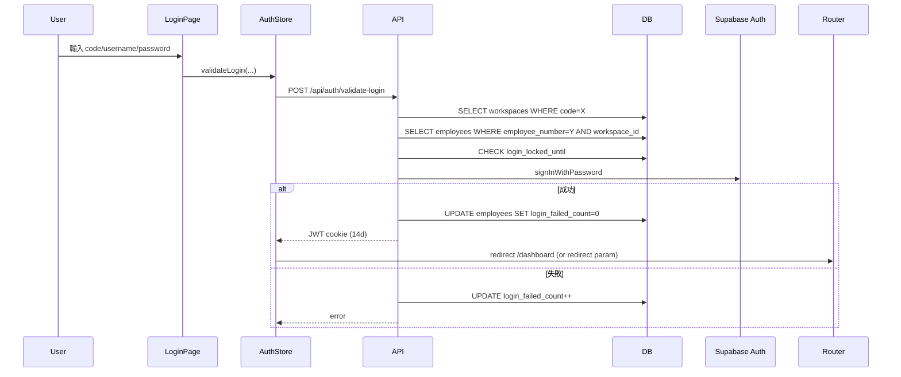

# Blueprint · `/login` 登入頁

> **版本**: v1.0 · 2026-04-18（cron auto-gen）
> **狀態**: 🟡 骨架、待 William 答 📋
> **Audit**: `VENTURO_ROUTE_AUDIT/01-login.md`
> **標記**: 📋 業務訪談 / 🔴 技術債 / ✅ 現狀正確 / 🛑 需動 DB

---

## 1. 存在理由（Purpose）

**一句話**：所有員工（Corner + Partner）進入 Venturo ERP 的**唯一入口**。公司代號 + 員工編號 + 密碼三欄位驗證。

### 服務對象
- **主要**：Corner 員工、Partner workspace 員工
- **次要**：bot 帳號（⚠️ 目前未擋、可登入）

### 解決什麼問題
- ✅ Multi-tenant 隔離（workspace code 先查、再驗員工）
- ✅ JWT 14 天免重登
- ✅ 帳號鎖定（5 失敗 15 分鐘、2026-04-17 剛補）

### **不**解決什麼問題（刻意排除）
- ❌ SSO / OAuth（目前純 email+password）
- ❌ 手機簡訊 2FA
- ❌ 個人註冊（員工由 HR 建立）
- ❌ 忘記密碼自助重設（未實作）

---

## 2. 業務流程（Workflow）

### 登入序列



### 合法狀態流轉
- 未登入 → 登入中 → 已登入 / 失敗（retry）
- 5 次失敗 → locked（15 分）
- session_expired → 回 login（URL param `reason=session_expired`）

📋 **待 William 確認**：
- 首次登入是否該強制改密碼（`must_change_password` 欄位存在但流程未接）？
- `rememberMe` 勾與不勾實際該差多少（目前都 14 天、UI 寫「30 天」）？
- bot 帳號（`is_bot=true`）是否應該直接擋在登入頁？

---

## 3. 資料契約（Data Contract）🛑 核心

### 讀取來源

| Table | 用途 | 方式 |
|--|--|--|
| `workspaces` | 透過 `code` 找 `workspace_id` | API route 直 query |
| `employees` | 透過 `employee_number + workspace_id` 驗帳號 | API route 直 query |
| `auth.users`（Supabase）| `signInWithPassword` 驗密碼 | Supabase Auth client |

### 寫入目標

| 欄位 | 時機 | 值 |
|--|--|--|
| `employees.login_failed_count` | 登入失敗時 +1、成功時歸 0 | int |
| `employees.login_locked_until` | 失敗 5 次時設（+15 min）| timestamptz |
| `employees.last_login_at` | 登入成功時 | timestamptz |

**localStorage**：
- `venturo-last-code`（UI prefill）
- `venturo-last-username`（UI prefill）
- `last-visited-path`（redirect 記憶）

### Source of Truth 表

| 欄位 | SoT | 備註 |
|--|--|--|
| `employee_number` | DB `employees` | UI 稱「帳號」、state 叫 `username`、API 叫 `username`、DB 叫 `employee_number` —— **4 個命名**（違反 INV-S03 命名統一）|
| `workspace.code` | DB `workspaces` | UI `.toUpperCase()`、API 也 `.toUpperCase()` ✅ |
| `password` | Supabase Auth `auth.users.encrypted_password` | 不在 `employees` 表 |
| `must_change_password` | DB `employees` | 🔴 流程未接 |
| `is_bot` | DB `employees` | 🔴 未在登入流程檢查 |
| `is_active` | DB `employees` | 🔴 只檢查 `status='terminated'`、漏檢查 `is_active=false` |

### 幽靈欄位
✅ **無**（API schema 對齊 employees、雖命名混亂）

### 無主欄位（DB 有 / Code 未用）
- `must_change_password`（業務決策 📋）
- `is_bot`（業務決策 📋）
- `is_active`（🔴 應補檢查）

---

## 4. 權限矩陣（Permissions）

| 角色 | 可登入 | 備註 |
|--|--|--|
| 系統主管 | ✅ | 登入後看全域 |
| 業務 | ✅ | 看自己 workspace |
| 會計 | ✅ | 看自己 workspace 財務 |
| bot | ✅ | 決定 2026-04-18：不擋（William：實務上沒人會用 bot 帳號登入、且未來機器人該用 API key 不該有帳號、此風險不存在） |
| 離職 (status=terminated) | ❌ | 已擋 |
| 停用 (is_active=false) | ⚠️ | 🔴 **未擋、bug**|
| Partner workspace 員工 | ✅ | 靠 `.eq('workspace_id', workspace.id)` 隔離 |

📋 **待 William 確認**：
- bot 帳號該全擋嗎？還是留給 AI 自動化（排程任務）登入？
- `is_active=false` 的員工登入該顯示什麼訊息（「帳號已停用、請洽系統主管」）？

---

## 5. 依賴圖（Dependencies）

### 上游（誰導向此頁）
- `middleware.ts` — 未登入 request redirect 此頁（帶 `redirect` param）
- `lib/auth-guard.tsx` — ⚠️ 這檔在 knip 判為 dead file、但 grep 有引用、待釐清
- `components/layout/main-layout.tsx` — 登出後跳
- `m/profile/page.tsx` — mobile 登出後跳

### 下游（此頁去哪）
- `/dashboard`（預設）
- `redirect` param 指定的路徑（若非 `/login` 本身）
- `last-visited-path` localStorage（fallback）

### 外部依賴
| 依賴 | 類型 | 用途 |
|--|--|--|
| `useAuthStore` (Zustand) | 內部 | 持久化 user / isAdmin / JWT 管理 |
| `POST /api/auth/validate-login` | 內部 API | 驗證 + 下 cookie |
| Supabase Auth | 外部服務 | `signInWithPassword` 驗密碼 |
| Zod (`validateLoginSchema`) | 內部 | 輸入驗證 |

### Component Tree
```
page.tsx (245 行) ⚠️ 違反 INV-P01 薄殼規則
└── 大量 inline styled form（code / username / password + remember + submit）
└── style JSX 區塊（約 70 行 CSS）
```

---

## 6. 設計決策（ADR）

### ADR-L1 · 三欄位 workspace code + username + password
**決策**：用 `code`（公司代號）+ `username` + `password` 三欄位、不用 email 登入。
**原因**：
- Multi-tenant：同一 `employee_number` 可能在不同 workspace 重複
- Partner 員工不用記特定 email domain
- UX：員工只記 `CORNER` / `E001` / `***` 比 email 快
**範圍**：限登入頁、內部 JWT 不含 code。
**引用 INVARIANT**：無違反。

### ADR-L2 · 命名漂移「帳號 / username / employee_number」
**決策（當前）**：UI 顯「帳號」、state/API 用 `username`、DB 欄位是 `employee_number`。
**違反 INVARIANT**：**INV-S03 命名統一**。
**理由**：歷史包袱、API schema 早於 DB 欄位決策。
**📋 待 William 確認**（2026-04-17 已口頭授權改、code 未動）：
- **Option A**：全系統統一 `employee_number`（UI、state、API、DB 都用）
- **Option B**：**新增 `username` 欄位**（DB）作為登入 identifier、保留 `employee_number` 作 internal ID
  - 2026-04-17 William 傾向此方案、配「首次登入跳 /change-password 設 username」
  - 影響 4-5 頁：`/hr` 新增員工、`/settings/account`、`/change-password`（新頁）、middleware、auth-store
- **Option C**：暫不改、等第二輪
**建議**：選 B、第二輪實作（需動 DB、migration 進 `_pending_review/`）。

### ADR-L3 · 「記住我」目前是假的
**現狀**：UI 寫「30 天內免重新登入」、實際 JWT 固定 14 天、勾不勾無差別。
**違反**：用戶期待 vs 實作不符（Trust debt）。
**📋 待 William 確認**：
- **Option A**：刪 UI checkbox、JWT 固定 14 天
- **Option B**：勾=30 天、不勾=1 天（典型設計）
- **Option C**：勾=14 天（現狀）、不勾=1 天
**建議**：B、但需改 API 的 JWT expiresIn 邏輯。

### ADR-L4 · page.tsx 245 行（違反 INV-P01）
**違反 INVARIANT**：**INV-P01 page 薄殼（≤ 50 行）**。
**理由**：
- 登入頁是整個 app 唯一前門、styled in JSX（custom CSS 佔 70 行）
- UI 簡單（1 form 3 input）、delegate 到 component 成本大於收益
- 第二輪若做設計系統整合、再拆成 `<LoginForm />` + `<LoginStyles />`
**範圍**：登入頁例外、其他 detail 頁不可比照。
**加入 INVARIANT 例外清單**：INV-P01 例外：`/login/page.tsx`（理由：唯一前門、styled in JSX）。

---

## 7. 反模式 / 紅線（Anti-patterns）

### ❌ 不要把 password 存 localStorage
**現狀**：只存 `code` + `username`、**不存 password**。✅ 正確。
**原因**：localStorage 可被 XSS 讀取。

### ❌ 不要繞過 workspace code 驗證
**規則**：即使拿到正確 `username` + `password`、若 `code` 錯、**必須拒絕**。
**原因**：防止暴力跨 workspace 試密碼。

### ❌ 不要回覆具體錯誤原因
**規則**：密碼錯、帳號不存在、帳號鎖定——對使用者統一顯示「帳號或密碼錯誤」。
**現狀**：✅ 有遵守（但帳號鎖定訊息較具體、可接受）。
**原因**：避免攻擊者枚舉帳號。

### ❌ 不要在 JWT 放敏感資料
**規則**：JWT 只含 `user_id` / `workspace_id` / `expires_at`、不含 email / phone / 權限清單。
**原因**：JWT 是 client-side readable、敏感資料應該查 DB。
**現狀**：需驗證（read `/api/auth/validate-login/route.ts`）。

### ❌ 不要 bypass rate limit
**規則**：login rate limit 每分鐘 10 次、不可繞過。
**原因**：防暴力破解。

---

## 8. 擴展點（Extension Points）

### ✅ 可安全擴展
1. **新增 auth provider**（例：Google OAuth for Partner）→ 加第二個 submit button、call 不同 API
2. **新增 error reason 的 URL param**（例：`reason=password_expired`）→ 在 `useEffect` 多一條判斷
3. **UI 設計調整** → 改 styled JSX 不影響 logic

### 🔴 擴展時需小心
4. **加新欄位**（e.g. `captcha_token`）→ 必須：
   - Zod schema 同步（`validateLoginSchema`）
   - API route 同步解析
   - middleware 若涉及、也要同步

5. **改 JWT expiresIn** → 同步：
   - API route 設 cookie maxAge
   - middleware 檢查 JWT 時 tolerance
   - client-side auth-store 的 refresh logic

### ❌ 不該在此頁做的事
- **新增員工**（那是 `/hr/new` 的職責）
- **改密碼**（應該有獨立 `/change-password` 頁）
- **忘記密碼**（應該有獨立 `/forgot-password` 頁 —— 尚未實作）
- **Profile 設定**（是 `/settings/account` 或 `/m/profile`）

---

## 9. 技術債快照

| # | 問題 | 違反 INVARIANT | 層級 |
|--|--|--|--|
| 1 | page.tsx 245 行（超薄殼上限）| INV-P01 | 🟡 P1（例外已記、第二輪拆）|
| 2 | 命名漂移 `employee_number` / `username` / 「帳號」| INV-S03 | 📋 P0 William 已授權 B 方案 |
| 3 | `must_change_password` 流程未接 | — | 📋 業務決策 |
| 4 | `is_bot` 未擋 | — | 📋 業務決策 |
| 5 | `is_active=false` 未擋 | — | 🔴 P0 bug |
| 6 | 「記住我」假的 | — | 📋 業務決策 |
| 7 | 硬編中文 7 處（`登入中...` `公司代號` `密碼` 等）| INV-U04 | 🟡 P1 |
| 8 | 錯誤訊息混中文硬編（「帳號或密碼錯誤」、「系統錯誤」）| INV-U04 | 🟡 P1 |
| 9 | inline CSS in JSX `<style>` 70 行（設計系統外）| — | 🟡 第二輪整合 design system |
| 10 | `auth-guard.tsx` 是 dead file 但此頁 grep 引用 | INV-X03 | 🟡 第二輪釐清 |

---

## 10. 修復計畫（SOP）

### Step 1 · 業務訪談（William）
- 回答本檔所有 📋 問題
- 確認 `must_change_password` / `is_bot` / `is_active` / rememberMe 行為

### Step 2 · 紅線內可修（🟢 下一 Stage C）
- **#5 `is_active=false` 未擋** — API route 加一條檢查（API code 改動、不動 DB、不需業務決策）
- **#7-8 硬編中文** — 搬進 `/login/constants/labels.ts`（已有部分、補齊）

### Step 3 · 需業務決策（🟡 Stage C 後、待 William）
- #3 `must_change_password` flow
- #4 `is_bot` 擋法
- #6 rememberMe 行為調整
- #2 username 欄位重構（B 方案、大工程）

### Step 4 · 第二輪
- #1 page.tsx 薄殼重構
- #9 design system 整合
- #10 auth-guard dead file 釐清

---

## 11. 相關連結

- **Audit**: `VENTURO_ROUTE_AUDIT/01-login.md`
- **API**: `src/app/api/auth/validate-login/route.ts`
- **Store**: `src/stores/auth-store.ts`
- **Schema**: `src/lib/validations/api-schemas.ts:232`
- **Migration**: `supabase/migrations/20260417120000_add_login_security_fields_to_employees.sql`
- **Middleware**: `src/middleware.ts`

---

## 變更歷史
- 2026-04-18 v1.0：cron auto-gen、基於 audit + code 讀檔、留 8 個 📋 待 William 訪談
