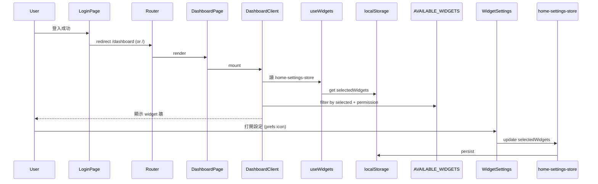

# Blueprint · `/dashboard` 儀表板 / 首頁

> **版本**: v1.0 · 2026-04-18（cron auto-gen · Wake 04:47+）
> **狀態**: 🟡 骨架、待 William 答 📋
> **Audit**: `VENTURO_ROUTE_AUDIT/02-dashboard.md`

---

## 1. 存在理由（Purpose）

**一句話**：登入後的預設頁、顯示可拖曳/自訂的小工具牆（12 個 widget）—— 計算機、匯率、天氣、航班、打卡、備忘錄、統計。

### 服務對象
- 所有登入員工（每人每天第一眼看到的頁）
- admin 看得比業務多（`admin_only` widgets）

### 解決什麼
- ✅ 每個角色的「快速入口」（業務看到常用計算機 + 匯率、會計看到打卡 + 航班）
- ✅ 可個人化（勾選 widget、拖曳排序）

### **不**解決
- ❌ KPI 儀表板（那是下一階段 `/monitoring` 或 `/finance/reports`）
- ❌ 多 workspace 橫向比較（partner 只看自己）
- ❌ 跨裝置同步（widget 設定只存 localStorage）

---

## 2. 業務流程（Workflow）



- 長按 500ms 觸發拖曳（避免誤觸）
- `isAdmin` 才看 `admin_only` widgets

---

## 3. 資料契約（Data Contract）🛑 核心

### 讀取來源

| 來源 | 用途 |
|--|--|
| `localStorage` (`home-settings`) | `selectedWidgets[]`、`selectedStats[]`、拖曳 order |
| `useAuthStore.isAdmin` | 過濾 `admin_only` widgets |
| 各 widget 自己的 API | 匯率 / 天氣 / 航班 / 打卡 等外部資料 |

### 寫入目標

| 目標 | 時機 |
|--|--|
| `localStorage` `home-settings` | widget settings 改動時 |
| **無 DB 寫入**（此頁本身不寫 DB）| — |

### Source of Truth

| 資料 | SoT | 備註 |
|--|--|--|
| `selectedWidgets[]` | localStorage | 🟡 跨裝置不同步（用戶抱怨點）|
| `selectedStats[]` | localStorage | 🟡 **可能 dead 欄位**（DashboardClient 沒讀）|
| widget order | localStorage | 拖曳 dnd-kit 存 |
| `isAdmin` | `auth-store` | 從 JWT 解 |

### 幽靈欄位
- `selectedStats` 若確認 DashboardClient 無讀 → 🟡 dead、第二輪清

### 🔴 重要：此頁**本身不動 DB**、但 widgets 各自會碰
- `flight-widget` → 航班 API（外部）
- `currency-widget` → 匯率 API（外部）
- `weather-widget` → 天氣 API（外部）
- `clock-in-widget` → DB `attendance_records`（寫入）
- `visa-widget` → DB `visas` / `customers`（讀）
- 📋 **每個 widget 需各自小 Blueprint**（第二輪）

---

## 4. 權限矩陣（Permissions）

| 角色 | 看 dashboard | admin_only widgets |
|--|--|--|
| admin | ✅ | ✅ 全 |
| 業務 | ✅ | ❌ |
| 會計 | ✅ | ❌ |
| partner | ✅ 看自己 workspace 資料 | ❌ |

引用 INVARIANT：**INV-A03 RLS 不當唯一防線**——dashboard 本身無 guard、靠 middleware + 各 widget 的 `requiredPermission`。

📋 **待 William 確認**：
- `admin_only` widget 清單定義在哪？（`widget-config.tsx` 或 hard-code?）
- Partner 看的 stats 是否已正確過濾 workspace？

---

## 5. 依賴圖（Dependencies）

### 上游（誰導向此頁）
- `/login` → 成功後跳這（預設 redirect）
- Sidebar home icon
- 任何 404 / unauthorized 時 fallback

### 下游（此頁去哪）
- 各 widget 點擊 → 跳對應功能頁（`flight-widget` → `/tools/flight-itinerary`、`visa-widget` → `/visas` 等）
- `WidgetSettings` dialog → 不跳頁

### Component Tree
```
/ (page.tsx, 5 行)          ← 違反「單一入口」但遵守 INV-P01 薄殼
/dashboard (page.tsx, 5 行)  ← 同上、但 duplicate
└── DashboardClient (163 行)
    ├── useWidgets (hook)
    │   └── home-settings-store
    ├── dnd-kit (drag & drop)
    ├── AVAILABLE_WIDGETS × 12
    └── WidgetSettingsDialog
```

### 外部 API 依賴（各 widget）
- 匯率 API
- 天氣 API
- 航班 API
- （各 widget 第二輪 audit）

---

## 6. 設計決策（ADR）

### ADR-D1 · `/` 和 `/dashboard` 重複路由
**現狀**：`/` 和 `/dashboard` 都是 5 行薄殼、都 render `<DashboardClient />`。
**問題**：同一內容兩個 URL、SEO/analytics 分裂、書籤混亂。
**✅ 決定 (2026-04-18)**：**Option B** — `/` 為主、刪 `/dashboard`
- 理由（William）：不用 dashboard 看起來比較專業、URL 乾淨
- 執行範圍（Stage C）：
  1. 刪 `src/app/(main)/dashboard/page.tsx` + 整個 `dashboard/` 目錄
  2. 改 `/login` `getRedirectPath` 預設值從 `/dashboard` 改 `/`
  3. 檢查 sidebar home link（應本已指 `/`）
  4. 更新 `docs/CODE_MAP.md` 路由表「首頁 /dashboard」改「首頁 /」
  5. grep 全 codebase `/dashboard` 字串、改成 `/`
- 引用 INVARIANT：無違反。

### ADR-D2 · Widget settings 存 localStorage
**現狀**：widget 勾選 / 順序只存 localStorage、跨裝置不同步。
**原因**：簡單、無 DB migration 成本。
**📋 待 William 確認**：
- **Option A**：保留 localStorage（跨裝置不同步是 feature、不是 bug——每裝置自己設）
- **Option B**：搬到 DB（`user_preferences` 表、新建、migration 進 `_pending_review/`）
- **Option C**：同步到 employees 表的 `preferences` jsonb 欄位（若 DB 加）
**引用 INVARIANT**：無違反（不是 server-state、Zustand 用 localStorage 合理）。
**建議**：短期 A、長期 B（Partner 員工可能在電腦+手機切換）。

### ADR-D3 · 雙胞胎 weather widget
**現狀**：`weather-widget.tsx` + `weather-widget-weekly.tsx` 兩份檔、audit 懷疑是 refactor 殘骸。
**📋 需技術驗證**（不是業務決策）：
- 查 `AVAILABLE_WIDGETS` 實際載哪個
- 跑 `gitnexus_impact` 兩個 symbol 看誰有 caller
- 若一個 refs=0 → Tier 3 cleanup 刪除（三方驗證：knip + gitnexus + grep）
**引用 INVARIANT**：**INV-X03 刪 code 三方驗證**。
**動作**：🟢 可在 Stage C 自動驗證（不是業務決策）。

### ADR-D4 · `home-settings-store` 命名漂移
**現狀**：feature 是 `dashboard`、store 叫 `home-settings-store`、page 叫 `DashboardPage` / `Home`。
**引用 INVARIANT**：**INV-S03 命名統一**（軟違反）。
**建議**：用 `gitnexus_rename` 改 store 為 `dashboard-settings-store`、第二輪做。
**影響**：12 個 widget 引用、需跨檔 rename。

---

## 7. 反模式 / 紅線

### ❌ Widget 直寫 UI 邏輯進 DashboardClient
**規則**：新 widget 必須是獨立 `*-widget.tsx` 檔、遵循既有 widget pattern（props interface、requiredPermission、i18n key）。
**原因**：DashboardClient 只負責佈局 + 拖曳、不懂各 widget 業務。

### ❌ 不要在 widget 裡存 server state 到 localStorage
**規則**：widget 若要顯示 DB 資料（如 `visa-widget`）、走 SWR hook、**不要**自己 cache 到 localStorage。
**引用 INVARIANT**：**INV-X01 Data fetching 偏好 SWR**。

### ❌ `admin_only` 不可當唯一權限檢查
**規則**：widget 顯示的資料、API route 端也必須檢 RLS / guard。
**原因**：前端隱藏 widget 只是 UX、不是安全（攻擊者可直接 call API）。

### ❌ 新 widget 必須走 `AVAILABLE_WIDGETS` 註冊
**規則**：不可直接 import 到 DashboardClient bypass 註冊機制。

---

## 8. 擴展點

### ✅ 可安全擴展
1. **新 widget**：建 `new-widget.tsx` + 加進 `AVAILABLE_WIDGETS` config
2. **新 language**：加進 `useI18n` 字典
3. **改預設 widgets**：改 `DEFAULT_WIDGETS` const（目前 `['calculator', 'currency']`）

### 🔴 需小心
4. **改 localStorage schema**：要寫 migration function、處理舊資料（避免用戶 widget 全消失）
5. **加「Team Dashboard」（業務看自己 + 部門）**：需新 API + 新 widget + 新權限 role
6. **Widget 間互動**（拖資料跨 widget）：dnd-kit 要擴展、避免互撞

### ❌ 不該做的
- **在 dashboard 做 CRUD**（那是各 feature 頁的職責）
- **把 dashboard 當「首頁 CMS」**（誰都能編輯 banner / 公告）—— 那是 `/marketing` 或 `/cms`

---

## 9. 技術債快照

| # | 問題 | 違反 INV | 層級 |
|--|--|--|--|
| 1 | `/` vs `/dashboard` 重複路由 | — | 📋 ADR-D1 待決 |
| 2 | widget settings 只 localStorage、跨裝置不同步 | — | 📋 ADR-D2 待決 |
| 3 | 雙胞胎 weather widget（weather-widget vs weather-widget-weekly）| INV-X03 | 🟢 可自動驗證 |
| 4 | `home-settings-store` 命名漂移 | INV-S03 | 🟡 第二輪 rename |
| 5 | `selectedStats` 疑似 dead 欄位（store 有、component 沒讀）| — | 🟢 驗證後清 |
| 6 | widget 硬編中文字串（如「設定」「拖曳排序」）| INV-U04 | 🟡 第二輪 |
| 7 | 12 widget 各自有外部 API 依賴、無統一 error boundary | — | 🟡 一個 widget 炸不該拖垮整頁 |
| 8 | widget-settings-dialog 的 a11y（icon-only buttons）| INV-U02 | 🟡 第二輪 |

---

## 10. 修復計畫

### Step 1 · 業務訪談（William）
- ADR-D1 路由重複 A/B/C
- ADR-D2 widget settings 存哪

### Step 2 · 下輪 Stage C 可做（🟢 不需業務、不動 DB）
- #3 驗證 weather widget 雙胞胎、若一個 refs=0 → 三方驗證後 Tier 3 cleanup
- #5 驗證 `selectedStats` 是否 dead、確認後清
- #7 加 widget error boundary（Sentry / React ErrorBoundary wrap 每個 widget）

### Step 3 · 第二輪
- #1 路由重複修（待 D1 決）
- #2 widget settings 搬 DB（待 D2 決）
- #4 store rename
- #6 i18n
- #8 a11y

### Step 4 · 第二輪 · 12 widget 各自 audit
- 每 widget 小 Blueprint、API 驗證、error handling

---

## 11. 相關連結

- **Audit**: `VENTURO_ROUTE_AUDIT/02-dashboard.md`
- **Client**: `src/features/dashboard/components/DashboardClient.tsx`
- **Store**: `src/stores/home-settings-store.ts`
- **Hook**: `src/features/dashboard/hooks/use-widgets.ts`
- **Widgets**: `src/features/dashboard/components/*-widget.tsx`（12 個）
- **README**: `src/features/dashboard/README.md`

---

## 變更歷史
- 2026-04-18 v1.0：cron auto-gen、基於 audit；留 2 📋 + 2 🟢 stage C 可做 + 4 🟡 第二輪
