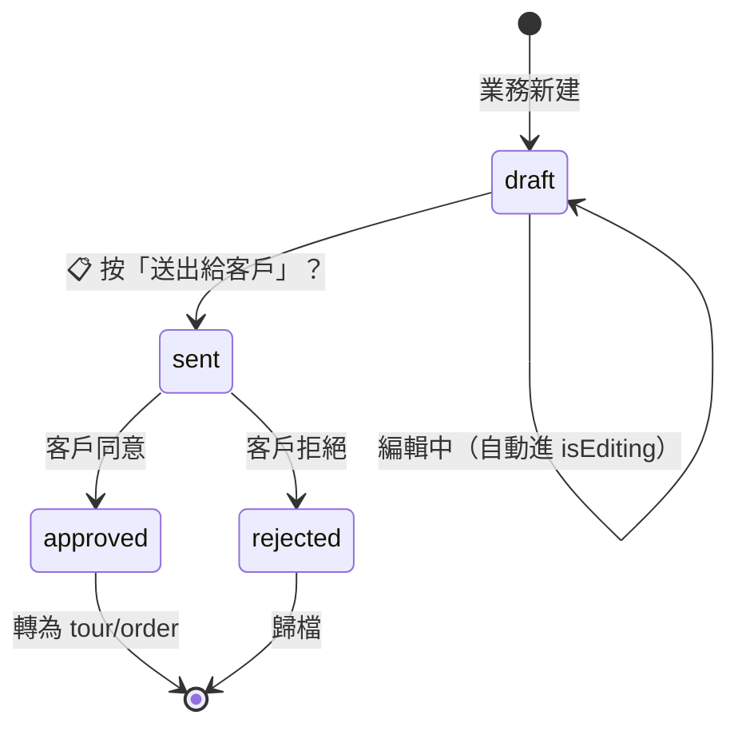

# Blueprint · `/quotes/quick/[id]` 快速報價單

> **版本**: v1.0 · 2026-04-18
> **狀態**: 🟢 範本（全公司 page 層參考）
> **Audit**: `VENTURO_ROUTE_AUDIT/06-quotes-quick.md`
> **標記**: 📋 = 待 William 業務確認；🔴 = 技術債；✅ = 現狀正確

---

## 1. 存在理由（Purpose）

**一句話**：客戶臨時問「這趟大概多少？」業務可以 10 分鐘出一張單、不用走 standard quote 的完整流程。

### 服務對象
- **主要**：Corner 業務（William、Caesar 等）
- **間接**：客戶（收到列印 PDF）

### 解決什麼問題
- ✅ 單張輕量報價（不分類、不分級、不分版本）
- ✅ 從現有 tour 行程快速帶入項目
- ✅ 印出 PDF 給客戶

### **不**解決什麼問題（刻意排除）
- ❌ 多版本報價（客戶要 3 個方案比較）→ 用 standard `/quotes/[id]`
- ❌ 分類報價（交通 / 住宿 / 餐飲 各自區塊）→ 用 standard
- ❌ 批量報價、正式合約、訂金流程
- ❌ 多階定價（大人 / 小孩 / 嬰兒不同價）

📋 **待 William 確認**：上面這些排除清單對嗎？是否還有我沒列的邊界？

---

## 2. 業務流程（Workflow）

### 狀態流轉



📋 **待 William 確認**：
- draft 之外還有哪些合法狀態？
- 狀態轉移的觸發點在哪（UI 按鈕 / API / 客戶回應）？
- quick quote 會轉成 order 嗎？還是只是報價、成單走別的流程？

### 典型使用情境
1. 客戶 LINE 問「日本 5 天大概多少？」
2. 業務開 `/quotes/quick/new`（或從 `/tours/[code]?tab=quick-quote`）
3. 填客戶資訊 → 按「載入行程項目」帶入核心表明細 → 調整單價
4. 儲存 → 列印 PDF → 傳給客戶

---

## 3. 資料契約（Data Contract）🛑 核心

### 讀取來源
| Table | 用途 | Hook/API |
|--|--|--|
| `quotes` (where `quote_type='quick'`) | 主資料 | `useQuote(id)` |
| `tour_itinerary_items` | 「載入行程項目」按鈕 | 🔴 目前直接 `supabase.from()` — 應改 `useTourItineraryItemsByTour` |

### 寫入目標
**唯一寫入 `quotes` 表**（不寫任何其他表）。寫入欄位**明確列出、不 spread**：

```ts
// useQuickQuoteDetail.ts:142-155
{
  customer_name, contact_phone, contact_address,
  tour_code, handler_name, issue_date, expense_description,
  total_amount, total_cost, received_amount, balance_amount,
  quick_quote_items
}
```

### Source of Truth 表

| 欄位 | SoT | Derived from | 備註 |
|--|--|--|--|
| `customer_name` | ✅ 此頁 | — | |
| `contact_phone` / `contact_address` | ✅ 此頁 | — | 📋 是否應該連 customers 表？還是 quote 獨立？ |
| `tour_code` | 🔗 `tours.code` | tour 主檔 | 業務手填 code string |
| `quick_quote_items[]` | ✅ 此頁 jsonb | — | 純前端拼裝、無 DB 結構約束 🔴 |
| `total_amount` | 📐 Derived | `sum(items.amount)` | 存快照、每次 save 重算 |
| `total_cost` | 📐 Derived | `sum(items.cost × qty)` | 同上 |
| `balance_amount` | 📐 Derived | `total_amount - received_amount` | 同上 |
| `received_amount` | ✅ 此頁 | — | 手動填 |
| `expense_description` | ✅ 此頁 | — | 🔴 DB 有此欄位但 `Quote` type 沒（type-cast hack） |

### 幽靈欄位（Code 寫 / DB 無）
✅ **此頁為零**（這是它當模範的主因）。

### 無主欄位（DB 有 / Code 無用）
📋 需跑 query 比對 quotes 表實際欄位 vs 此頁讀寫欄位差集。

### jsonb 結構契約：`quick_quote_items`
```ts
type QuickQuoteItem = {
  id: string          // nanoid, 新增時產生
  description: string // e.g. "Day1 機票: 長榮 BR189"
  quantity: number    // 預設 1
  unit_price: number  // 業務填
  amount: number      // = quantity × unit_price（前端計算）
  cost?: number       // 載入行程時從 confirmed_cost 帶
  notes?: string
}
```

🔴 **DB 層無 CHECK 約束**，歷史資料可能有非 array 或缺欄位的 item。
✅ **建議 migration**（紅線安全）：
```sql
-- 跑前先驗證
SELECT id FROM quotes
WHERE quote_type='quick' AND jsonb_typeof(quick_quote_items) != 'array';
-- 若無違規：
ALTER TABLE quotes ADD CONSTRAINT quick_items_array_check
  CHECK (quote_type != 'quick' OR jsonb_typeof(quick_quote_items) = 'array');
```

---

## 4. 權限矩陣（Permissions）

### 路由層
🔴 **目前無 guard**（`page.tsx` 無 role check）—— 靠 RLS 擋。

### RLS 層（Supabase）
```sql
-- 推測（📋 需確認實際 policy）
quotes.workspace_id = get_current_user_workspace()
```

### 角色 × 動作

| 角色 | 看列表 | 看詳情 | 新建 | 編輯 | 刪除 | 列印 |
|--|--|--|--|--|--|--|
| 系統主管 | 📋 | 📋 | 📋 | 📋 | 📋 | 📋 |
| 業務 | 📋 | 📋 僅自己? | 📋 | 📋 僅 draft? | 📋 | 📋 |
| 會計 | 📋 | 📋 | ❌ | ❌ | ❌ | ✅ |
| partner | — | — | — | — | — | — |

📋 **待 William 確認整張表**。目前推測：業務只能改自己 draft 的、approved 後不能改。

---

## 5. 依賴圖（Dependencies）

### 上游（誰會導向此頁）
- `/quotes` 列表 → 點 row（如果 quote_type='quick'）
- `/tours/[code]?tab=quick-quote` → 頁內嵌入（**embedded mode**）
- `/quotes/quick/new` → 新建後 redirect

### 下游（此頁會跳去哪）
- 返回按鈕：
  - 若有 `tour_code` → `/tours/[tour_code]?tab=quick-quote`
  - 否則 → `/quotes`
- 列印：`PrintableQuickQuote` dialog（不跳頁）

### 外部依賴
| 依賴 | 類型 | 用途 |
|--|--|--|
| `tour_itinerary_items` 表 | DB | 「載入行程項目」 |
| `nanoid` | npm | 新項目 id |
| `sonner` (`toast`) | npm | 操作反饋 |
| FullCalendar / Chart | — | 無 |
| 外部 API | — | 無（不呼 LinkPay / 藍新 / LINE） |

### Component Tree
```
page.tsx (46 行薄殼)
└── QuickQuoteDetail (246 行)
    ├── ResponsiveHeader (非 embedded)
    ├── QuickQuoteHeader        ← features/quotes/components/quick-quote/
    ├── QuickQuoteItemsTable
    ├── QuickQuoteSummary
    └── PrintableQuickQuote (列印預覽 dialog)

hooks: useQuickQuoteDetail (202 行)
       useQuote (資料層)
```

---

## 6. 設計決策（ADR）

### ADR-Q1：為什麼 page.tsx 只 46 行（薄殼）
**決策**：所有 logic 放 hook、所有 UI 放 component、page 只做 router + loading guard。
**原因**：
- 易測試（hook 單測不用 mock next/router）
- 支援 `embedded` prop（/tours/[code] 可嵌入同一個 component）
- 未來重構 page 不動 logic
📋 **採用範圍**：William 是否同意把此 pattern 套用到所有 detail 頁？（目前 `/quotes/[id]` 614 行違反）

### ADR-Q2：為什麼 quote 分 standard vs quick
📋 **待 William 解釋背景**：
- 當初為何要拆成兩種？
- 業務上使用比例大約？
- 兩種在 DB 是同表（`quotes` + `quote_type`）但 UI 完全分離——這個決策對嗎？

### ADR-Q3：為什麼明細用 jsonb `quick_quote_items`、不用子表
**推測原因**：單張報價、項目不會跨表查詢、jsonb 比子表快。
**代價**：
- 失去 DB 層約束（🔴 歷史資料格式可能壞）
- 無法單獨查「賣最多的項目」（要 jsonb_array_elements 展開）
📋 **待 William 確認**：這個 trade-off 合理嗎？未來要做「項目分析」時會痛嗎？

### ADR-Q4：為什麼 handleSave 明確列 12 個欄位不 spread
**決策**：`onUpdate({ 欄位1, 欄位2, ... })` 而非 `onUpdate({ ...formData })`。
**原因**：避免幽靈欄位——type 多欄、DB 少欄、spread 會讓 PostgREST 靜默丟掉。
**對照反例**：`/quotes/[id]` 用 spread → 7 個幽靈欄位。
✅ **此 pattern 應寫入 DEV_STANDARDS.md、做為硬規則**。

### ADR-Q5：為什麼 auto-save 關掉改手動
**原始設計**：800ms debounce auto-save（hook 仍有 `triggerAutoSave` / `pendingItemsRef` 殘留）。
**後來改動**：`useQuickQuoteDetail.ts:121-123` 註解關掉。
**原因**（hook 註解）：「降 DB 負載」。
📋 **待 William 確認**：
- 確實因為 DB 負載？還是其他原因（auto-save 壞過、資料覆蓋問題）？
- 確定手動存檔後，剩下的 `triggerAutoSave` / `autoSaveTimer` / `pendingItemsRef` 應刪（dead code）。

---

## 7. 反模式 / 紅線（Anti-patterns）

### ❌ 不要 spread 寫 DB
```ts
// ❌ 錯：會造成幽靈欄位
onUpdate({ ...formData, ...extra })
// ✅ 對：明確列欄位（此頁現況）
onUpdate({ customer_name, contact_phone, ... })
```

### ❌ 不要直 `supabase.from()` 查 `tour_itinerary_items`
```ts
// ❌ 錯（此頁現況 🔴）
await supabase.from('tour_itinerary_items').select(...)
// ✅ 對
const { items } = useTourItineraryItemsByTour(tour_id)
```
**原因**：SWR cache 不共享、其他頁改完這頁讀到舊。CLAUDE.md 明文規定。

### ❌ 不要在 `quick_quote_items` 外新增平行欄位
未來要加「備註區」「條款區」時、**不要在 quotes 表加新 jsonb 欄**。
✅ 加在 `quick_quote_items[]` 的 item 裡、或另建 `quote_terms` 表。

### ❌ 不要把 standard quote 的邏輯塞進此頁
此頁是**刻意輕量**。若客戶需要多版本、categories、tier pricing、**請引導使用 `/quotes/[id]`**、不要在 quick 加功能。

### ❌ 不要為 `expense_description` 這種 DB 欄位加 type-cast hack
```ts
// ❌ 錯（此頁現況 🔴）
(quote as typeof quote & { expense_description?: string }).expense_description
// ✅ 對
// 補進 Quote type 正式欄位
```

---

## 8. 擴展點（Extension Points）

### ✅ 可安全擴展的地方
1. **`QuickQuoteItem` 新欄位**（如 `category_tag`, `supplier_id`）
   → 加 jsonb item 欄位 + TypeScript type 補齊即可
2. **新的操作按鈕**（如「複製此報價」）
   → 加到 `ActionButtons` component
3. **Embedded 的新嵌入頁**（目前只有 /tours/[code]）
   → 加 `<QuickQuoteDetail quote={...} embedded />` 即可

### 🔴 擴展時需小心
4. **新增狀態值**（如 `pending_review`）
   → 必須同步改：
   - 狀態流轉圖（本檔 §2）
   - `isEditing` 初始邏輯（目前只認 `draft`）
   - 權限矩陣（§4）
   - DB CHECK constraint（📋 目前無）

5. **改 `quick_quote_items` 結構**
   → 歷史資料 migration + 加 CHECK constraint + PrintableQuickQuote 欄位

### ❌ 不應該在此頁做的事
- **加多版本比較**（這是 standard quote 的職責）
- **加 tier pricing**（同上）
- **連 LinkPay / 收款流程**（此頁只報價、不收錢、收錢走 /finance/payments）
- **加批次匯出**（這屬於 /quotes 列表頁）

---

## 9. 技術債快照（🔴 同步 Audit）

| # | 問題 | 位置 | 狀態 |
|--|--|--|--|
| 1 | 「載入行程項目」cost 只讀 `confirmed_cost` | QuickQuoteDetail.tsx | ✅ 2026-04-18 修（`confirmed ?? quoted ?? estimated ?? 0`）|
| 2 | 編輯中返回無 unsaved 檢查 | QuickQuoteDetail.tsx | ✅ 2026-04-18 修（`handleBack` + `confirmDialog`）|
| 3 | 直 query `tour_itinerary_items`（違反 CLAUDE.md） | QuickQuoteDetail.tsx | ✅ 2026-04-18 改用 `useTourItineraryItemsByTour` |
| 4 | `triggerAutoSave` / `pendingItemsRef` / `autoSaveTimer` dead code | useQuickQuoteDetail.ts | ✅ 2026-04-18 刪 |
| 5 | `expense_description` type-cast hack | useQuickQuoteDetail.ts | ✅ 2026-04-18 移除（Quote type 早已有此欄位）|
| 6 | Cross-route import（從 `/quotes/[id]/constants` 取 label）| page.tsx | ✅ 2026-04-18 移除（label 搬到本路由）|
| 7 | `day_number nullable` → 顯示「Daynull」 | QuickQuoteDetail.tsx | ✅ 2026-04-18 改 `?? '?'` |
| 8 | `addItem` id 用 `Date.now()` 可撞 | useQuickQuoteDetail.ts | ✅ 2026-04-18 改 `nanoid()` |
| 9 | 硬編中文 7 處 | 多處 | 🟡 P1 |
| 10 | 列印 race（`window.print` 同步關 dialog）| QuickQuoteDetail.tsx | 🟡 P1 |
| 11 | 金額精度（`12.1 × 3 = 36.300...`）| QuickQuoteDetail.tsx / hook | 🟡 P1 |
| 12 | Save 失敗未 rollback（catch 不回復 isEditing）| useQuickQuoteDetail.ts | 🟡 P1 |
| 13 | 無權限守衛（路由層）| page.tsx | 📋 需 William 決策角色 |
| 14 | `quick_quote_items` jsonb 無 DB CHECK | DB | 📋 migration 只寫不跑、待點頭 |

---

## 10. 修復計畫（SOP）

### Step 1：業務訪談（William 必補）
- 回答本檔所有 📋 問題
- 確認狀態流轉、權限矩陣、quote 分類策略

### Step 2：DB 安全加固（紅線內）
- 補 `quick_items_array_check` CHECK constraint
- 補 `Quote` type 的 `expense_description` 欄位

### Step 3：修 3 個 P0
- 載入行程時的 cost fallback 鏈
- 編輯中返回 confirm
- `supabase.from` → `useTourItineraryItemsByTour`

### Step 4：清 dead code
- 刪 auto-save 殘骸

### Step 5：套到別頁
- 把 `/quotes/[id]` 重寫為薄殼 + `<QuoteDetailCore embedded />`

---

## 11. 相關連結

- **Audit 原報告**：`VENTURO_ROUTE_AUDIT/06-quotes-quick.md`
- **CODE_MAP**：`docs/CODE_MAP.md`（路由 → 檔案 字典）
- **ADR 總表**：`docs/ARCHITECTURE_DECISIONS.md`（📋 ADR-Q1~Q5 應合併進去）
- **核心表設計**：`docs/ITINERARY_LIFECYCLE.md`
- **欄位規範**：`docs/FIELD_NAMING_STANDARDS.md`

---

## 變更歷史
- 2026-04-18 v1.0：初版、基於三方 agent audit 產出；留 📋 待 William 業務訪談補完
