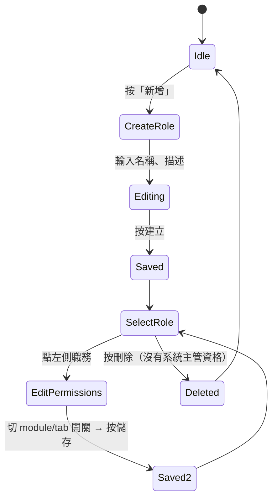

# Blueprint · `/hr/roles` 職務管理

> **版本**: v1.0 · 2026-04-18
> **狀態**: 🟡 骨架、William 重排優先加入核心（建團前置）
> **Audit**: 無（原不在 12 核心、本輪直接 Stage A+B 合併）
> **優先級**: **end-to-end path 第二站**（登入 → 🎯職務 → 建團 → 建單 → 請款 → 收款）

---

## 1. 存在理由（Purpose）

**一句話**：定義 workspace 內的**職務**（業務 / 會計 / 領隊 / 助理...）+ 每個職務的**細粒度權限**（功能模組 × 分頁的讀/寫）。

### 為什麼它是 end-to-end path 的**前置**
William 指出：「建團還有業務沒辦法選」——
- 建團時要選**承辦業務**（下拉選單）
- 下拉資料來源 = `employees WHERE role = '業務'`
- 若沒先建「業務」職務、或沒分派員工給該職務 → **下拉空 / 選不到人**
- 故建團前必須先讓職務設定可用

### 服務對象
- **系統主管** 設定職務與權限
- 其他路由**讀取**職務資料（建團、建單時用來篩選員工）

### 解決什麼
- ✅ 多 workspace 各自有自己的職務列表（Corner 可以有「業務」「會計」、Partner 可以有「老闆」「打雜」）
- ✅ 細粒度權限（某角色可讀財務但不能改）
- ✅ `is_admin` 特殊角色（全權限、不可刪）

### **不**解決
- ❌ 員工 onboarding（那是 `/hr` 新增員工）
- ❌ 多角色兼任的業務邏輯（例如：業務兼會計）—— 📋 DB 有 `employee_job_roles` 多對多、但目前 UI 不確定用哪套

---

## 2. 業務流程（Workflow）



- 權限結構：**功能模組** × **分頁** × {can_read, can_write} 雙層
- `is_admin` 角色全開、不可改、不可刪

📋 **待 William 確認**：
- 預設應該有哪些職務？（業務 / 會計 / 領隊 / 助理？）
- 是否應該有「預設模板」一鍵建出標準 3-5 職務？

---

## 3. 資料契約（Data Contract）🛑 核心

### 讀取來源

| Table | 用途 |
|--|--|
| `roles` | 職務主表（id, name, description, is_admin, sort_order, workspace_id）|
| `role_tab_permissions` | 權限 matrix（role_id, module_code, tab_code, can_read, can_write）|
| `MODULES` (code) | 模組定義（寫死在 `src/lib/permissions/`）|
| `workspace_features` | 透過 `useWorkspaceFeatures` 過濾此 workspace 啟用的模組 |

### 寫入目標

| Target | 時機 |
|--|--|
| `POST /api/roles` → `roles` table | 新增職務 |
| `PUT /api/roles/[id]/tab-permissions` → `role_tab_permissions` | 儲存權限 |
| `DELETE /api/roles/[id]` | 刪職務（沒有系統主管資格）|

### Source of Truth

| 資料 | SoT | 備註 |
|--|--|--|
| role 名稱/描述/order | `roles` 表 | workspace-scoped |
| 各 role 的權限 | `role_tab_permissions` | role_id × module × tab 三重鍵 |
| 員工 ↔ 職務關聯 | **📋 兩種結構並存！**（關鍵問題）|

### ✅ 員工 ↔ 職務：**單一主職務**（2026-04-18 決定）

```
employees.role_id (FK → roles.id)     ← ✅ 保留、唯一 SoT
employee_job_roles                     ← ❌ 刪除（migration draft 已寫）
```

- 每個員工一個 role
- 建團查業務：`SELECT employees WHERE role_id IN (SELECT id FROM roles WHERE name = '業務' AND workspace_id = X)`
- **不做員工層級個別權限微調**（權限跟 role 走、不跟人走）

### 幽靈欄位
暫無明顯（page 用 `fetch('/api/roles')` 走 API、API 層轉譯、未深挖）

---

## 4. 權限矩陣

| 角色 | 看職務頁 | 建/刪職務 | 改權限 |
|--|--|--|--|
| 系統主管 | ✅ | ✅ | ✅ |
| 其他角色 | 🔴 目前無擋 | 🔴 目前無擋 | 🔴 目前無擋 |

違反 INVARIANT：**INV-A02 Settings 必系統主管**（本頁屬 HR 管理、同理必系統主管）。

📋 **待 William 確認**：是否只有 admin 該看/改？還是 HR 主管也能改？

---

## 5. 依賴圖

### 上游
- `/hr` HR 主頁 → 點「職務管理」tab

### 下游（會讀 roles 資料的頁）
- **`/tours/[code]` 建團**（選業務、團控）← William 關注的重點
- **`/orders` 建單**（選承辦業務）
- `/hr` 員工列表（顯示每個員工的職務）
- `/hr/new` 新增員工（分派職務）
- 任何有 permission guard 的頁（read `role_tab_permissions` 判斷）

### Component Tree
```
/hr/roles/page.tsx (613 行 ⚠️ 違反 INV-P01)
├── ContentPageLayout
│   └── HR_ADMIN_TABS
├── Role List (左、col-span-3)
│   └── 新增 Dialog
└── Permission Matrix (右、col-span-9)
    ├── MODULES loop (filter by useWorkspaceFeatures)
    │   ├── module Switch can_read / can_write
    │   └── tabs Switch can_read / can_write（展開時）
    └── Save Button
```

---

## 6. 設計決策（ADR）

### ADR-R1 · 雙層權限（module × tab × read/write）
**決策**：每個職務的權限不是「單一 boolean」、而是 `{module × tab} × {can_read, can_write}` 矩陣。
**原因**：
- 業務可以「看訂單但不能改」
- 會計可以「改財務但看不到業務客戶詳情」
- 細粒度合規
**缺點**：UI 複雜（613 行 page）、設定成本高、新人上手慢
**範例**：`業務` 角色可能有：Tours.read, Tours.write, Orders.read, Orders.write, Finance.read（不寫）

### ADR-R2 · `employees.role_id` + `employee_job_roles` 雙軌 → **Option A 單一主職務**
**✅ 決定 (2026-04-18)**：**Option A** — 保 `employees.role_id`、刪 `employee_job_roles`
- William 原話：「設定職務然後建立人物的時候，就是選這個職務 不要做細節微調」
- 每個員工**一個**主職務、不兼任、不逐人微調權限
- 權限 100% 跟 role 走、不跟人走
**執行**：
1. Migration 寫進 `supabase/migrations/_pending_review/20260418_drop_employee_job_roles.sql`（🛑 只寫不跑）
2. 建員工 UI：選 role 下拉
3. 建團 UI：業務下拉 = `SELECT employees WHERE role_id = <業務 role.id>`
4. 若找到「員工層級個別權限微調」功能 → 標 🔴 刪除
**影響**：
- **解鎖建團 Blueprint**
- 刪 `employee_job_roles` 表（需 William 審核 SQL + backup）
- 建員工 UI 需確認 role 下拉是必填

### ADR-R3 · 此頁違反 INV-A02（無 系統主管 guard）
**現狀**：任何登入員工都能打開 `/hr/roles` 看/改權限
**違反**：INV-A02 Settings 必系統主管
**動作**：下輪 Stage C 自動補（🟢、page 開頭加 isAdmin check）

### ADR-R4 · page.tsx 613 行 違反 INV-P01
**違反**：INV-P01 page 薄殼（≤ 50 行）
**現狀**：page.tsx 直接寫了 role list UI + permission matrix UI + 2 個 dialog
**應該**：delegate 到 `<RolesPage />` feature component
**層級**：🟡 第二輪重構

---

## 7. 反模式 / 紅線

### ❌ 不要繞過 role_tab_permissions 做自訂權限
**規則**：要加新權限點、改 `role_tab_permissions` 的 module/tab code、**不要**在其他地方寫 hardcoded permission check

### ❌ 不要刪 `is_admin` 角色
**規則**：UI 已擋、API 層也必須拒絕（若系統主管被刪、沒人能管系統）

### ❌ 不要在 role.name 用特殊字元
**規則**：name 用於 UI 顯示 + API 查詢、避免 SQL injection / path issue

### ❌ 不要把 role_id 當 role_name 字串比對
**規則**：查「是不是業務」、用 `role.name === '業務'` **錯**（名稱會改）。應該：
- 用 `role.id` 或
- 用**role slug**（若有）
- 或查 permission matrix 實際看有沒有特定權限

---

## 8. 擴展點

### ✅ 安全擴展
1. **加新 module**：編輯 `src/lib/permissions/` 的 `MODULES` 陣列
2. **加新 role**：UI 已支援（除了系統主管外）
3. **角色模板**：📋 預設 3-5 標準職務一鍵建出

### 🔴 需小心
4. **改 module_code / tab_code**：會讓既有 `role_tab_permissions` 孤兒（migration 需同步改）
5. **刪 module**：同上、要先清 permissions
6. **加跨 role 的「繼承」（業務繼承一般員工）**：目前無此設計、加會破 1-1 mapping

### ❌ 不該做
- **硬編 role 邏輯**（`if (role.name === '業務')` 散落）
- **讓沒有系統主管資格 改權限**

---

## 9. 技術債快照

| # | 問題 | 違反 INV | 層級 |
|--|--|--|--|
| 1 | page.tsx 613 行（直寫 UI）| INV-P01 | 🟡 第二輪 |
| 2 | 無 系統主管 guard、任何員工可改權限 | INV-A02 | 🔴 P0、🟢 Stage C 可修 |
| 3 | `employees.role_id` + `employee_job_roles` 雙軌不一致 | INV-D04 SoT 單一 | 📋 業務決策、重要 |
| 4 | `handleDeleteRole` 用 `confirm()` native（非 design system）| INV-U03 | 🟡 第二輪 |
| 5 | 硬編中文（「新增」「儲存」「請選擇角色」）| INV-U04 | 🟡 第二輪 |
| 6 | Dialog 二次確認用 `confirm()`（native、UX 不一致）| — | 🟡 第二輪 |
| 7 | `fetch('/api/roles')` 未走 SWR、每次重抓 | INV-X01 | 🟡 第二輪、影響刷新 |
| 8 | Toast 用 `useToast` 而非 sonner（專案有兩套）| — | 🟡 統一 |

---

## 10. 修復計畫

### Step 1 · 業務訪談（William）**優先**
- ADR-R2：`employees.role_id` vs `employee_job_roles` 選哪個？（直接影響建團 Blueprint）
- 是否該有預設職務模板？
- HR 主管是否能改權限、還是只有 admin？

### Step 2 · 下輪 Stage C（🟢 自動）
- #2 補 系統主管 guard（page 開頭 `if (!isAdmin) redirect('/unauthorized')`）

### Step 3 · 第二輪
- #1 page 薄殼重構
- #3 雙軌 → 單一（待 ADR-R2）
- #4-8 UI 細節

---

## 11. 相關連結

- **Page**: `src/app/(main)/hr/roles/page.tsx`（613 行）
- **API**: `src/app/api/roles/route.ts` + `src/app/api/roles/[id]/tab-permissions/route.ts`
- **Modules 定義**: `src/lib/permissions/index.ts`（MODULES）
- **Feature flag**: `src/lib/permissions/hooks.ts`（useWorkspaceFeatures）
- **Component**: `src/features/hr/components/ModulePermissionTable.tsx`
- **DB schema**: `roles` / `role_tab_permissions` / `employee_job_roles` / `employees.role_id`

---

## 變更歷史
- 2026-04-18 v1.0：William 重排優先加入核心（建團前置）、Stage A+B 合併（無既有 audit）
